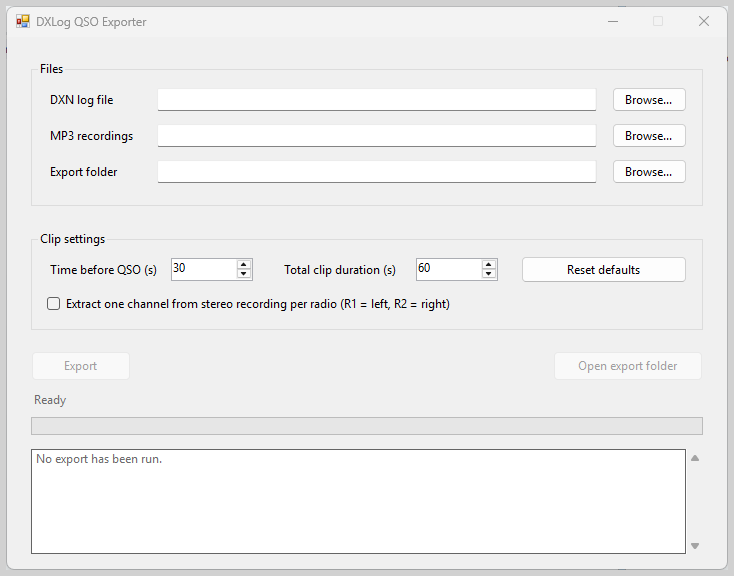

# DXLog QSO Exporter

DXLog QSO Exporter reads a SQLite-based DXLog `.dxn` log and its MP3 recordings, including older `qsodata` logs, then writes one MP3 clip for each QSO with a valid saved recording position. Normal QSOs and XQSOs are supported; XQSO filenames carry an `_XQSO` suffix. Default exports copy complete MP3 frames losslessly.

For a friendly, step-by-step walkthrough, see the [User Guide](docs/user-guide.md) ([Bosanski](docs/user-guide.bs.md) | [Deutsch](docs/user-guide.de.md)). For supported database schemas and compatibility details, see [Compatibility](docs/compatibility.md).



## Requirements

- Windows 10 or Windows 11, x64
- .NET Framework 4.8
- DXLog closed while the export runs

## Use

1. Select the `.dxn` log file.
2. Select the folder containing its MP3 recordings and an output folder. Current recordings normally use names such as `000.mp3`; older single-file logs are supported when the folder contains exactly one non-numbered MP3.
3. Choose the timing, optionally select **Extract one channel per radio (R1 = left, R2 = right)**, and select **Export**. In that mode, outputs are re-encoded as mono MP3 files in `R1` and `R2` subfolders.

The default window starts 30 seconds before the QSO save time and lasts 60 seconds. **Reset to DXLog defaults** restores both values. The output folder is not created until export starts.

The `.dxn` database is opened read-only and checked before its QSO rows are read. Default audio is copied as complete MP3 frames, without decoding or re-encoding. Optional radio-channel extraction decodes the selected stereo channel and re-encodes it as mono. Legacy recordings with the recognized DXLog metadata block are supported; an incomplete terminal frame is ignored because it cannot be part of a complete clip. A typical output name is:

```text
000123_2026-08-28_1423_G3ABC_20M_CW.mp3
000124_2026-08-28_1424_G4XYZ_20M_CW_XQSO.mp3
```

The run writes one `_export-report_{yyyyMMddTHHmmssZ}.txt` file in the output folder. It lists totals and explains skipped or failed QSOs. A clip near a recording boundary may be **shortened** because the requested window is clamped to that source file. Missing positions, missing recordings, corrupt or changing sources, and existing output files are reported rather than guessed around or overwritten.

## Limitations

- QTC and WAE exports are not supported. QTC groups do not carry a saved recording position, so an export would be an unverifiable approximation.
- Only single-computer logs are supported. Networked multi-computer logs can contain colliding local recording indexes.
- Legacy `.dxl` files are not supported or migrated. Older SQLite `.dxn` logs using the `qsodata` contract are supported when their recording folder contains one unnumbered MP3; ambiguous folders with multiple non-numbered MP3 files are not guessed.
- Each QSO must have a valid saved recording file index and byte position.
- Windows are fixed around the QSO save time. Conversation boundaries are not detected.
- Clips are never stitched across recording files.
- The utility opens source logs and recordings strictly read-only and never modifies original files. Default export is 100% lossless bit-exact frame copying without transcoding; optional R1/R2 extraction decodes stereo channels and re-encodes them to mono MP3s.

## Design decisions

- .NET Framework 4.8 and WinForms keep the utility native to the Windows machines used with DXLog.
- x64 is the only target so SQLite native deployment stays predictable.
- SQLite is accessed directly and read-only; DXLog must be closed before export.
- Saved recording positions are authoritative. Timestamp and file-metadata guesses are not used.
- Complete MP3 frames are copied so output is fast and lossless.
- The portable ZIP has no installer, updater, telemetry, or crash-reporting service.

## Build and test

From a Windows machine with the .NET SDK installed:

```powershell
dotnet restore .\DxLogQsoExporter.sln
dotnet build .\DxLogQsoExporter.sln --configuration Release -p:Platform=x64
dotnet test .\DxLogQsoExporter.sln --configuration Release -p:Platform=x64 --no-build
```

The application uses NAudio for MP3 frame parsing and System.Data.SQLite for read-only SQLite access. See [THIRD-PARTY-NOTICES.md](THIRD-PARTY-NOTICES.md).